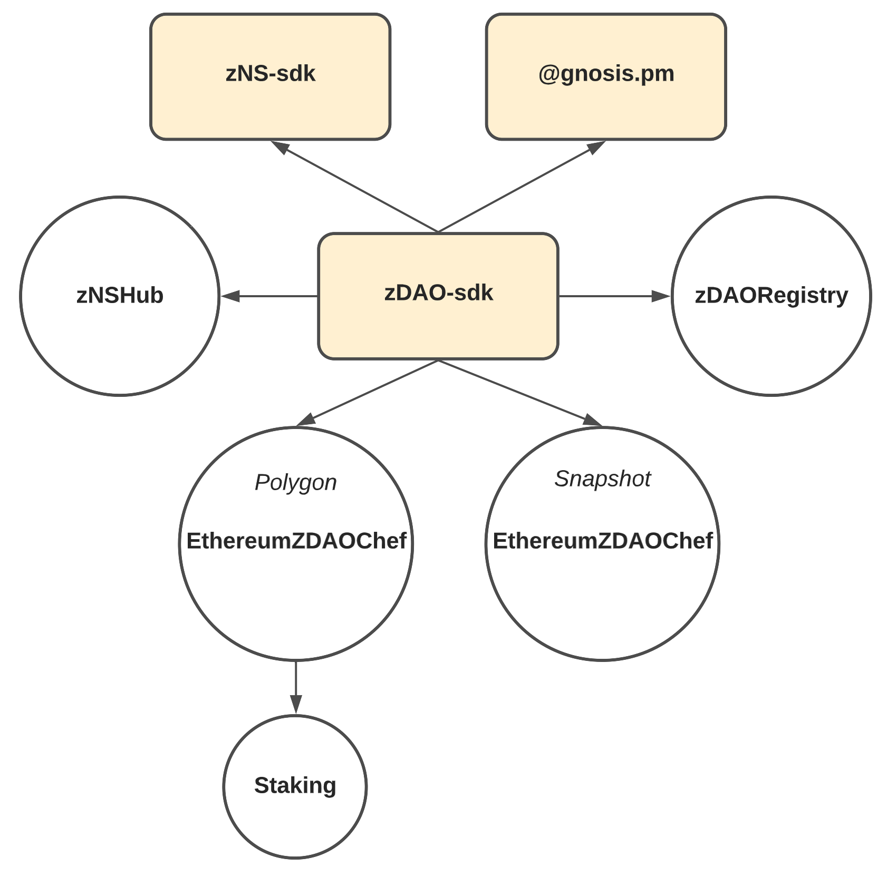
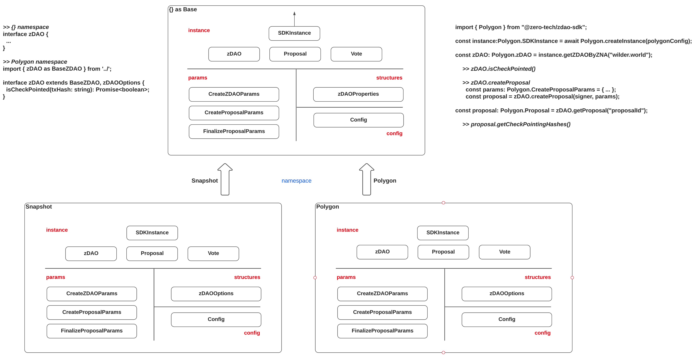

# zDAO-sdk

zDAO supports multiple platforms, e.g. Snapshot, and Polygon.

## Overview

### Common Functionality Requirements

- [x] Create zDAO with parameters
- [x] List all the associated zNAs
- [x] Get zDAO by associated zNA
- [x] List all the assets(coin, collectibles) of zDAO from associated Gnosis Safe
- [x] List all the transactions of zDAO from associated Gnosis Safe
- [x] List all the proposals of zDAO
- [x] Create funding proposal in zDAO
- [x] List all the votes and voting result of proposal
- [x] Cast a vote on proposal who has holding of certain amount of voting token
- [x] Execute a proposal by Gnosis Safe owners if succeed

### Collaboration Diagram

Every platform has different properties, so while building `zDAO` voting system on different platforms may have different interfaces.

[](docs/Collaboration.png)

- `zDAO-sdk` is using `zNS-sdk` to convert `zNA` to `zNAId`, and is using `@gnosis.pm` to transfer funds from Gnosis Safe wallet to user.
- `zNSHub`: Only `zNA` owner can create `zDAO`, `zNSHub` is used to check if user is owning given `zNA`.
- `zDAORegistry`: This contains the list of `zDAOId` and association with `zNA`s, it is used to iterate `zDAO` and associated `zNA`s.
- `EthereumZDAOChef` on Polygon: Main contract for Polygon voting, extends from `IZDAOFactory` and contains the list of `zDAO`s and address to Polygon Smart Contracts.
- `EthereumZDAOChef` on Snapshot: Main contract for Snapshot voting, extends from `IZDAOFactory` and contains the list of `ENS` of Spaces in Snapshot.

### Class Diagram

`zDAO-sdk` defines the common interfaces for `zDAO`, `Proposal`, and `Vote`. Each platform extends from the parent interfaces and adds additional properties.



## `zDAO` on Snapshot

Check out the [docs](docs/snapshot/) folder for more documents.

## `zDAO` on Polygon

Check out the [docs](docs/polygon/) folder for more documents.

## Code Example

Following codes explain how to use `zDAO-sdk` in the client by Polygon platform as an example.

### Create SDK instance

Every SDK instance is created by platform-specific configuration in development or production mode.

Example code for creating SDK instance of Polygon platform.

```TypeScript
const config = Polygon.productionConfiguration({
  ethereum: {
    zDAOChef: '0x****',
    rpcUrl: 'https://eth-mainnet.alchemyapi.io/v2/***',
    network: SupportedChainId.ETHEREUM,
    blockNumber: 71****,
  },
  polygon: {
    zDAOChef: '0x****',
    rpcUrl: 'https://polygon-mainnet.infura.io/v3/***',
    network: SupportedChainId.POLYGON,
    blockNumber: 27****,
  },
  zNA: {
    zDAORegistry: '0x****',
    zNSHub: '0x****',
    rpcUrl: 'https://eth-mainnet.alchemyapi.io/v2/***',
    network: SupportedChainId.ETHEREUM,
  },
  proof: {
    from: '0x****',
  },
  fleek: {
    apiKey: '****',
    apiSecret: '****',
  },
  ipfsGateway: 'snapshot.mypinata.cloud',
  zNSProvider: jsonRpcProvider,
});

const sdkInstance: Polygon.PolygonSDKInstance = await Polygon.createSDKInstance(
  config
);
```

### Create zDAO

Example code for creating zDAO with signer(`ethers.Wallet`).

```TypeScript
const zDAO: Polygon.PolygonZDAO = await sdkInstance.createZDAO(signer, undefined, {
  zNA: 'wilder.world',
  name: 'Wilder World',
  network: SupportedChainId.ETHEREUM,
  gnosisSafe: '0x****',
  token: '0x****',
  amount: BigNumber.from(10).pow(18).toString(), // 1 token
  duration: 86400, // 1 day in seconds
  votingThreshold: 5001, // 50.01%
  minimumVotingParticipants: 1, // 1 member
  minimumTotalVotingTokens: BigNumber.from(10).pow(18).toString(), // 1 token
  isRelativeMajority: true, // relative majority
});
```

### Create Proposal

Example code for creating proposal with signer(`ethers.Wallet`).

```TypeScript
const proposal: Polygon.PolygonProposal = await zDAO.createProposal(signer, undefined, {
  title: 'Hello Proposal',
  body: 'Hello World',
  transfer: {
    sender: '0x****', // Gnosis Safe Address
    recipient: '0x****',
    token: '0x****', // Token address in Gnosis Safe wallet
    decimals: 18, // Token decimals
    symbol: 'WILD', // Token symbol
    amount: BigNumber.from(10).pow(18).mul(50).toString(), // Transfer amount
  },
});
```

### Cast a vote

Example code for casting a vote with signer(`ethers.Wallet`).

```TypeScript
const votingPower = await proposal.getVotingPowerOfUser(
  mumbaiSigner.address
);
// If signer has voting power, then cast a vote
if (BigNumber.from(votingPower).gt(BigNumber.from(0))) {
  await proposal.vote(mumbaiSigner, undefined, {
    choice: 1,
  });
}
```

## Coding Guideline

### Folder structure

- `client`: Common Clients including abstract DAO, Proposal, Gnosis Safe, and zNS clients, which are used by platforms.
- `config`: ABI and typechain files for common use.
- `polygon`: Develop implementation codes for Polygon platform.
- `snapshot`: Develop implementation codes for Snapshot platform.
- `types`: Common interfaces across zDAO and Proposal.
- `utilities`: utility functions

### Coding Guideline for new platform

Check out [ClassDiagram](#class-diagram) and [types](src/types/instances.ts#L39).

SDKInstance, zDAO and Proposal are generic types, which will be extended by platform.

1. Define types

- Instances

  - Define the types of Vote, Proposal, zDAO and SDKInstance extending from the parent one
  - Names must start from platform name. e.g. [PolygonVote](src/polygon/types/instances.ts#L171), [PolygonProposal](src/polygon/types/instances.ts#L116), [PolygonZDAO](src/polygon/types/instances.ts#L94), [PolygonSDKInstance](src/polygon/types/instances.ts#L14).
  - Override functions which has extended parameters differ from parent. e.g. [createZDAO](src/polygon/types/instances.ts#L36).
  - Define additional functions and members in Proposal, zDAO, and SDKInstance. e.g. [isCheckpointed](src/polygon/types/instances.ts#L101), [staking](src/polygon/types/instances.ts#L19).

- Configuration

  - Extend the [configuration](src/polygon/types/config.ts#L8) from the parent one.

- Parameters
  - Extend the [parameters](src/polygon/types/params.ts#L10) from the parent one if requires.

2. Implement clients

   > Mock clients are used only when creating DAO and proposals from params.

- Implement DAO client.

  - DAO client must extend generic type of [`AbstractDAOClient`](src/client/AbstractDAOClient.ts), implementing re-defined instance interface.
  - Add getter function of additional properties.
  - Write not-implemented functions.
  - Write `createInstance` async function to create DAO client.

- Implement Proposal client.

  - Proposal client must extend generic type of [`AbstractProposalClient`](src/client/AbstractProposalClient.ts), implementing re-defined instance interface.
  - Add getter function of additional properties.
  - Write not-implemented functions.
  - Write `createInstance` async function to create Proposal client.

3. Third-party platform integration

- Integrate with third party platform like Smart Contracts and Snapshot.
- Client can have internal [types](src/polygon/polygon/types.ts).
