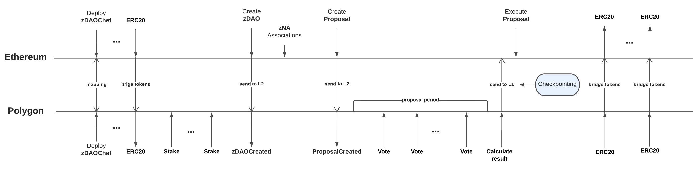
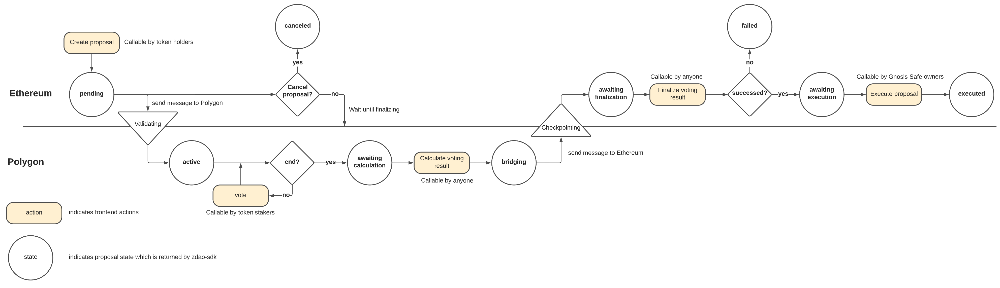
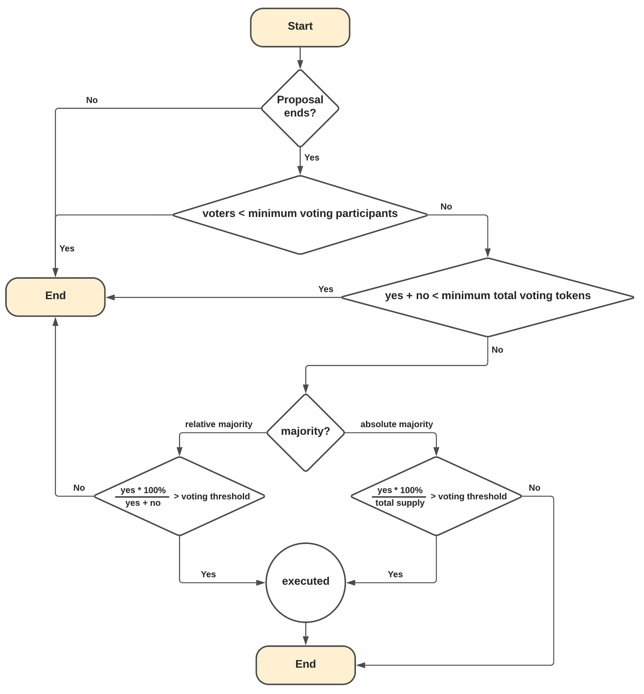

# Voting on Polygon

## Additional Functionality Requirements

- [x] Create on-chain zDAO
- [x] Transfer State from Ethereum to Polygon
- [x] Calculate a proposal when the proposal ends
- [x] Finalize proposal when the proposal is calculated
- [x] Stake ERC20 or ERC721 tokens as voting power

## Map voting tokens between Ethereum and Polygon

Users participate in voting on Polygon, it requires that let users bridge voting tokens from Ethereum to Polygon.

To map tokens, check out the [docs](https://github.com/zer0-os/zdao-token-mappings)

## Staking

Users can stake voting tokens on Polygon, staked amount at the snapshot of a created proposal is voting power.
Users can unstake anytime if they don't want to participate.

## Voting Timeline

## Proposal State Changes

The proposal has the following proposal states:

- `pending`: The proposal was created and waiting to be synchronized to Polygon.
- `active`: The proposal was successfully created and synchronized to Polygon, voters can participate in voting.
- `awaiting calculation`: The proposal was ended and ready to calculate the voting result on Polygon and send it to Ethereum.
- `bridging`: The proposal triggered the calculation of the voting result on Polygon and sent it to Ethereum.
- `awaiting finalization`: The calculated voting result arrived on Ethereum and is ready to finalize the result.
- `failed`: The proposal failed on voting.
- `awaiting execution`: The proposal is succeeded in voting and is ready to execute the proposal.
- `executed`: The proposal is successfully executed.

## How to check if a proposal is succeeded

